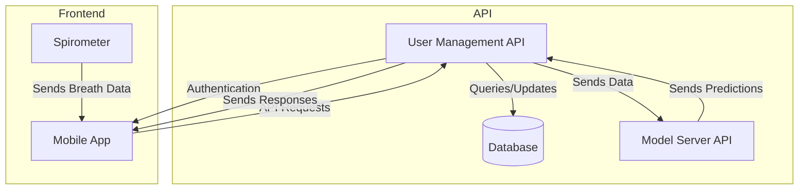

# Architecture

## High-Level System Architecture

## Tech Stack

* Frontend:
  * Mobile App: React Native (TypeScript) with Gluestack UI for components
  * Spirometer: Arduino Uno (MicroPython)
* Backend:
  * API: Spring Boot (Java)
  * User Management: Spring Security with authentication + Spring Boot REST API
  * Database: PostgreSQL
  * Model Server: FastAPI (Python) with PyTorch (Python) and Redis for caching
* Deployment:
  * Docker
  * Docker Compose
  * Cloudflare Tunnel
  * JSON for communication between services
* Build Tools:
  * Maven for Java projects
  * npm for React Native project
  * Expo for React Native development
