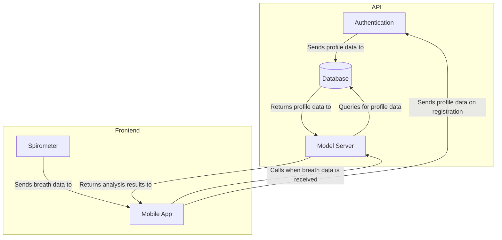
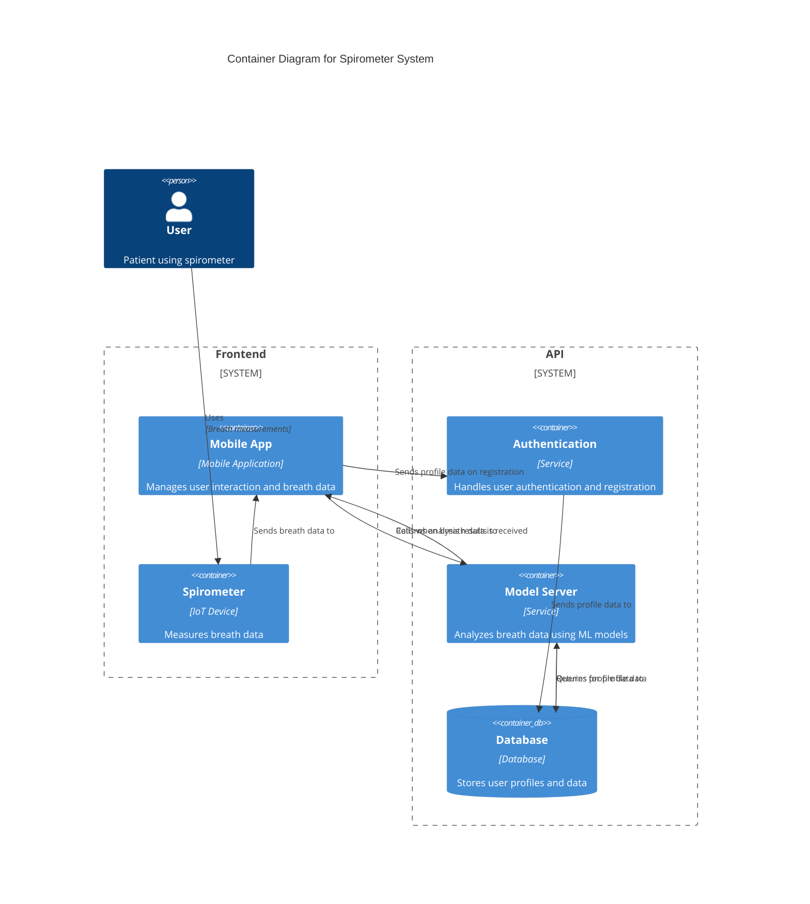

# Architecture Diagrams

## High-Level System Architecture

```mermaid
flowchart TD
    subgraph api["API"]
        auth[Authentication]
        db[(Database)]
        model[Model Server]
        
        auth --"Sends profile data to"--> db
        model --"Queries for profile data"--> db
        db --"Returns profile data to"--> model
    end
    
    subgraph frontend["Frontend"]
        spirometer[Spirometer]
        app[Mobile App]
        
        spirometer --"Sends breath data to"--> app
    end
    
    app --"Sends profile data on registration"--> auth
    app --"Calls when breath data is received"--> model
    model --"Returns analysis results to"--> app
```

## Low-Level Architecture

```mermaid

C4Container
    title Container Diagram for Spirometer System

    Person(user, "User", "Patient using spirometer")
    
    System_Boundary(frontend, "Frontend") {
        Container(app, "Mobile App", "Mobile Application", "Manages user interaction and breath data")
        Container(spirometer, "Spirometer", "IoT Device", "Measures breath data")
    }
    
    System_Boundary(api, "API") {
        Container(auth, "Authentication", "Service", "Handles user authentication and registration")
        Container(model, "Model Server", "Service", "Analyzes breath data using ML models")
        ContainerDb(db, "Database", "Database", "Stores user profiles and data")
    }
    
    Rel(user, spirometer, "Uses", "Breath measurements")
    Rel(spirometer, app, "Sends breath data to")
    Rel(app, auth, "Sends profile data on registration")
    Rel(app, model, "Calls when breath data is received")
    Rel(auth, db, "Sends profile data to")
    Rel(model, db, "Queries for profile data")
    Rel(db, model, "Returns profile data to")
    Rel(model, app, "Returns analysis results to")
```
