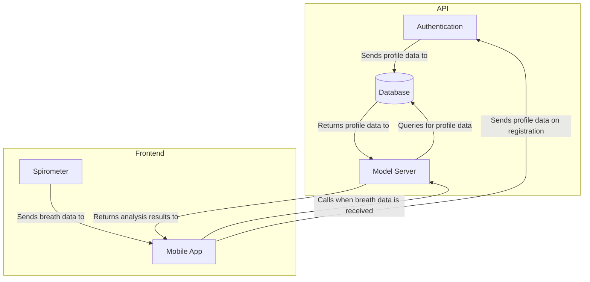

# Architecture

## High-Level System Architecture

## Tech Stack
* Frontend:
  * Mobile App: React Native (TypeScript)
  * Spirometer: Arduino Uno (MicroPython)
* Backend:
  * API: Spring Boot (Java)
  * Authentication: Spring Security JWT (Java)
  * Database: PostgreSQL
  * Model Server: Spring Boot (Java) with PyTorch (Python) and Redis for caching
    * **NOTE**: Redis may not be necessary depending on performance and time
* Deployment:
  * Docker
  * Kubernetes
  * AWS or Azure (Decision TBD)
  * gRPC for communication between services
* Build Tools:
  * Maven for Java projects
  * npm for React Native project
  * Expo for React Native development
