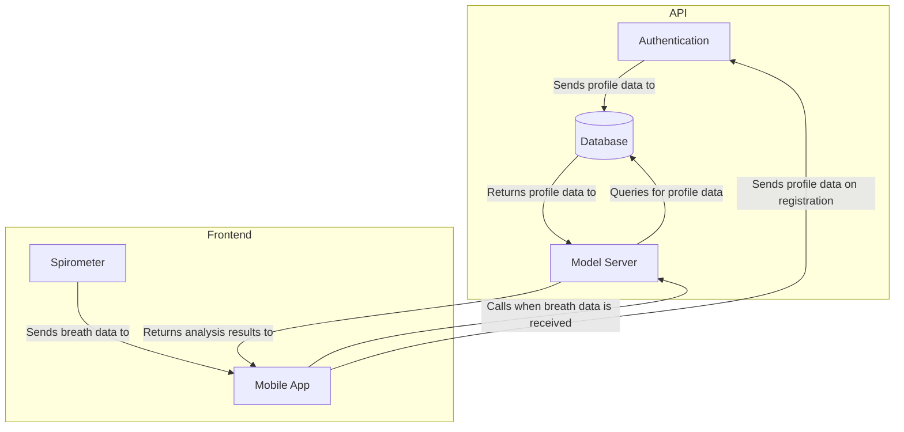

# Architecture Diagrams

## High-Level System Architecture

```mermaid
flowchart TD
    subgraph api["API"]
        auth[Authentication]
        db[(Database)]
        model[Model Server]
        
        auth --"Sends profile data to"--> db
        model --"Queries for profile data"--> db
        db --"Returns profile data to"--> model
    end
    
    subgraph frontend["Frontend"]
        spirometer[Spirometer]
        app[Mobile App]
        
        spirometer --"Sends breath data to"--> app
    end
    
    app --"Sends profile data on registration"--> auth
    app --"Calls when breath data is received"--> model
    model --"Returns analysis results to"--> app
```

